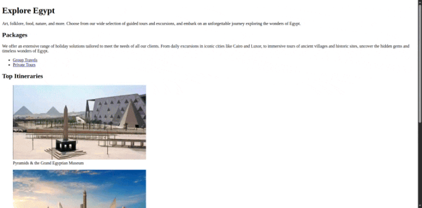

# Travel Agency ✈️

This is a travel agency webpage that showcases exciting travel destinations.

---

## Technologies Used 💻

- **HTML**

---

## Preview 🎥



---

## Live Demo 🌐

Check out the live demo of the project here: [Live Demo](https://elhostakosta.github.io/travel-agency)

---

## How to Use 🚀

1. **Clone the Repository**:
    ```bash
    git clone https://github.com/elhostakosta/travel-agency.git
    ```
2. **Open the Project**:
    Navigate to the project folder and open the `index.html` file in your favorite web browser.

---

## Credits 🙌

- **Images Source**: [itacTRAVEL](https://www.itactravel.com/%D8%A7%D9%87%D9%85-%D8%A7%D9%84%D8%A7%D9%85%D8%A7%D9%83%D9%86-%D8%A7%D9%84%D8%B3%D9%8A%D8%A7%D8%AD%D9%8A%D8%A9-%D9%81%D9%8A-%D8%A7%D9%84%D9%82%D8%A7%D9%87%D8%B1%D8%A9/)
- **Inspiration**: This project was inspired by FreeCodeCamp's curriculum.

---

## License 📜

This project is open-source and available under the [MIT License](LICENSE). Feel free to use, modify, and share it!